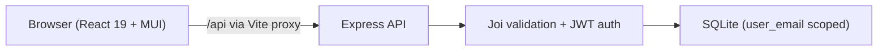
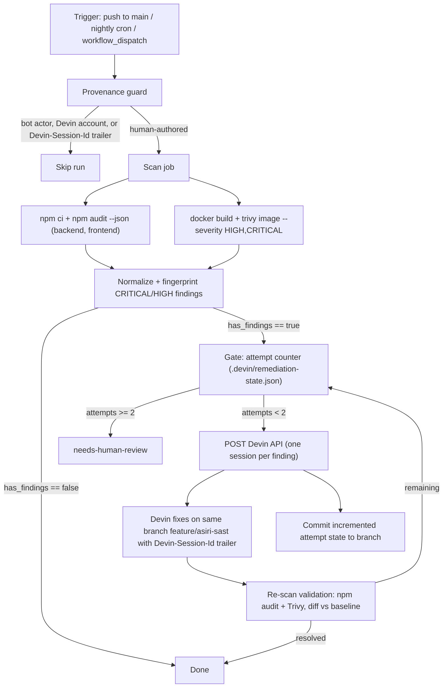

# Architecture

## Application

Multi-tenant time-tracking application.

| Layer | Location | Stack |
|---|---|---|
| Backend API | `backend/` | Node 20, Express, SQLite (in-memory), Joi validation, JWT auth |
| Frontend SPA | `frontend/` | React 19, TypeScript, Vite, Material UI, TanStack Query |
| Container | `docker/Dockerfile` | Multi-stage `node:20-alpine`; frontend `dist/` served by the backend |
| Agent config | `.devin/` | Devin rules, skills, subagents, hooks |

Every backend query is parameterized and scoped by `user_email`; request bodies
are validated by the Joi schemas in `backend/src/validation/schemas.js`.

## CI / security tooling

### Existing workflows (`.github/workflows/`)

- `pr-checks.yml` — on pull requests: lint, tests, build, and a frontend
  `npm audit` job (`security-audit`). If it fails and the PR author matches, a
  `trigger-devin-cve-fix` job calls the Devin v3 API once per PR (guarded by a
  "Devin CVE Auto-Fix" PR comment marker).
- `sast-scan.yml` — `SAST Auto-Remediation (Devin)`: reacts to a failed
  SonarCloud `check_run` on a PR and asks Devin for a one-time fix pushed to the
  PR branch. Skips Devin-authored PRs and PRs already attempted.
- `deploy.yml` — deployment.

Both Devin-calling workflows are PR-scoped and limited to a single attempt via
comment markers.

### New: event-driven SAST auto-remediation

`.github/workflows/sast-auto-remediate.yml` (`SAST Auto-Remediate`) adds a
branch-level pipeline that is independent of pull requests. It runs on pushes
to `main`, nightly, or on demand, and remediates on `feature/asiri-sast`.
Full details: [`SAST-REMEDIATION.md`](SAST-REMEDIATION.md).

Design points:

- **Decoupled jobs** — `provenance`, `scan`, `dispatch`, `rescan` communicate
  through job outputs and artifacts (`sast-reports`, `sast-gate`, `sast-rescan`).
- **No `pull_request` trigger** and a `Devin-Session-Id:` trailer check keep the
  pipeline from reacting to its own output (no infinite loop).
- **Stable fingerprints** (`npm:<pkg>@<range>:<GHSA>`, `trivy:<CVE>:<pkg>`)
  drive both dispatch and the two-attempt retry budget.
- **Same-branch strategy** — fixes and state go straight to
  `feature/asiri-sast`; no branches or PRs are created by Devin.
- **Secrets** — `DEVIN_API_KEY` (required) and optional
  `DEVIN_CREATE_AS_USER_ID`; the Devin org id is fixed in the workflow env.
